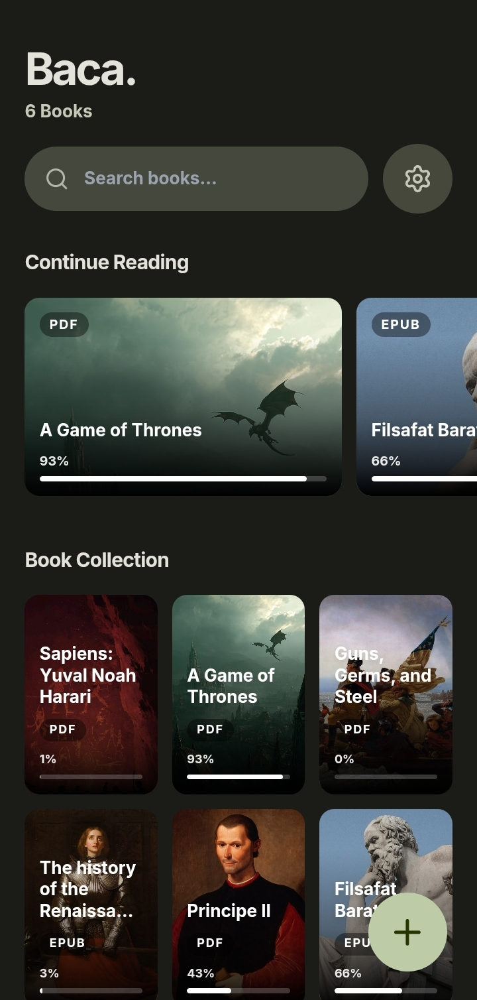

<div align="center">

# 📖 Baca.

**A privacy-first, local e-book reader built with Material 3 Expressive design.**


</div>

---

Baca. is a web-based e-reader that runs **100% locally in your browser**. No servers. No tracking. No accounts. Just your books, beautifully rendered with fluid Material 3 Expressive animations.

## ✨ Why Baca.?

Single HTML file. Tailwind CSS. Vanilla JavaScript. No build step, no framework, no dependencies to install.

The core obsession of this project is a **seamless reading experience** — books that flow as continuous text, not flipped pages — wrapped in an interaction design that actually feels alive. Morphing buttons, spring-animated modals, a FAB that stretches on press. Every animation uses the same `cubic-bezier(0.34, 1.56, 0.64, 1)` spring curve as Android 14. It's not decoration; it's the point.

Everything runs client-side. Your books never leave your device.

## 🚀 Features

- 🎨 **Material 3 Expressive** — morphing shapes, spring physics animations, dynamic color tokens. 15 palettes + Dark Mode + AMOLED Pitch Black.
- 📚 **EPUB & PDF support** — EPUB renders fully. PDF extracts clean text (ideal for born-digital books, novels, and academic papers).
- ⚡ **Offline & local-first** — powered by `localForage` + IndexedDB. Zero data leaves your device.
- 🖍️ **Annotations & highlighting** — 4 highlight colors, persistent notes per annotation, per book.
- 🧠 **Smart Lookup** — select any text to instantly query Wikipedia, Wiktionary, and Dictionary API in parallel.
- 📖 **Reading progress** — auto-saved per book, with a "Continue Reading" shelf on the home screen.
- 📱 **PWA** — install directly from Chrome to your home screen. Works like a native app.
- ✏️ **Library management** — edit metadata, swap covers, batch delete, custom card shapes.

## 📸 Screenshots

<div align="center">

| Library | Reading | Quick Wikipedia |
|---|---|---|
|  |  |  |

</div>

## 🛠️ Usage

No install. No npm. No setup.

```bash
git clone https://github.com/your-username/baca.git
```

Open `index.html` in any modern browser. Done.

For the full PWA experience (offline support, home screen install), serve it via a local server — the VSCode Live Server extension works fine.

**To install as an app:** open in Chrome/Edge → three-dot menu → "Install app".

## 🤝 Contributing

This project is a single HTML file. The barrier to contribute is as low as it gets — fork, edit, PR.

All contributions welcome: bug fixes, new features, refactors, translations.

### 🚨 Wanted: Android Developer

The entire app is built on a highly responsive web foundation. If you're comfortable with **Android Studio WebView, Capacitor, Cordova, or a TWA wrapper**, your contribution would be enormous. Packaging this into a standalone APK is the most requested missing piece. Open an issue or drop a PR — seriously, please.

**Workflow:**

1. Fork the repo
2. `git checkout -b feature/your-feature`
3. `git commit -m 'Add your feature'`
4. `git push origin feature/your-feature`
5. Open a Pull Request

## 📄 License

MIT — use it, modify it, ship it.
